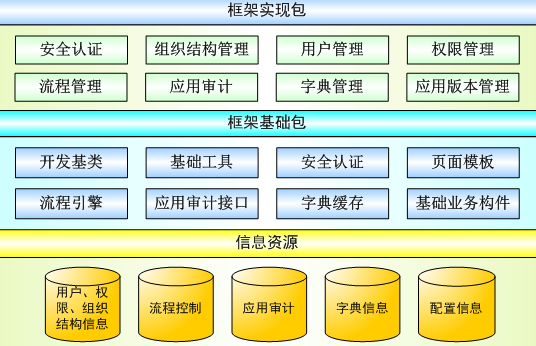

# 应用架构

开发框架提供使用的同时，需提供相应的使用说明、开发规范、开发样例等文档。

开发框架功能架构如下图所示：

### 开发基础包

+ 开发基类：用于供应用功能实现模块继承和调用的基础bo、dao、service、controller、exception、test等基础包。
+ 基础工具：通用字符串、日期时间、数字、图片、加密解密等工具类。
+ 安全认证：提供安全认证bo和service标准接口，并提供登录的页面和controller层实现
+ 页面模板：提供典型页面的静态jsp模板
+ 流程引擎：提供标准流程引擎
+ 应用审计接口：提供业务系统记录审计日志信息的标准接口
+ 字典缓存：通过配置，在应用启动时将字典加载到内存中，并实现字典数据定时自动重新获取的功能，同时提供重载字典数据的rest服务
基础业务构件：实现公告、流水号、文书等通用基础业务构件

### 框架实现包 

+ 安全认证：对开发基础包中用户登录、用户登出、单点登录、登录失败处理、ca认证等接口的实现。
+ 组织结构管理：机关和部门信息的维护和查看。
+ 用户管理：用户信息的管理。
+ 权限管理：用户和用户组权限管理。
+ 流程管理：流程建模、流程实例展示和流程实例查看。
+ 应用审计：应用审计日志接收、报警、查询、统计。
+ 字典管理：字段数据的维护。
+ 应用版本管理：维护应用信息版本发布信息。