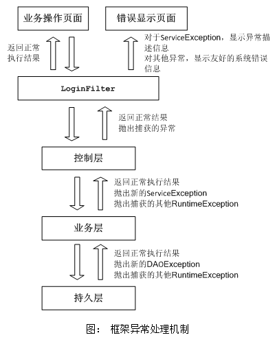

# 统一异常处理

我们从用户使用的角度，将错误和异常分为两大类：

+ 业务逻辑上产生的错误。比如，用户增加一个企业，业务层校验时，发现同名的企业已经存在，会抛出一个业务逻辑的异常。这种异常是用户在进行一定的业务操作时，因业务逻辑上的问题产生的，用户是能够理解的，并知道要采取一定的操作措施。
+ 系统产生的错误。比如，数据库连接失败，系统会抛出异常；数据库执行语句错误，系统会抛出异常。这种异常并不是由于用户的业务逻辑引起的，而且用户也无法理解。

我们在`com.wondersgroup.esf.base.exception`包中，定义了两个公共异常类：`ServiceException`和`DAOException`。这两个类都是继承自`RuntimeException`，原因是Spring对事务的控制，是通过捕获`RuntimeException`异常进行的，一旦在业务层捕获到`RuntimeException`或者其子类，事务就会回滚，否则，事务会被提交。

本框架的错误和异常处理机制，如下图所示：

持久层的大多数异常，是由spring和hibernate负责抛出的，他们抛出的异常都是RuntimeException的子类。持久层的其他一些异常，需要由我们编码时判断的，应该在编码时统一抛出DAOException异常。持久层捕获到异常后，只负责抛出，不处理异常。

业务层的异常，一部分是从持久层抛出的，另一部分是在业务层编码判断的业务逻辑异常。对于持久层抛出的异常，业务层无需特别处理，业务层会继续抛出。对于业务逻辑的异常，需在业务层抛出ServiceException，并在抛出时给出明确的异常描述信息，以便在错误页面上显示。

Web不对异常进行特殊处理，只需继续抛出即可。

所有的异常，会在本框架中定义的过滤器LoginFilter中统一处理，该过滤器会根据web.xml的配置文件，过滤控制层请求。过滤器捕获到异常后，会输出log信息，并将用户操作页面转向到错误提示页面。如果捕获到的是ServiceException，错误提示页面上将会显示ServiceException的异常描述信息。如果捕获到的是其他异常，错误提示页面将统一显示友好的系统错误信息。

我们在持久层、业务层、控制层设计和编码时，请使用隐式异常处理方式，不要定义显式的异常。显式异常指方法定义时使用throws语句，隐式异常指在方法内部处理异常，需要时使用throw语句。