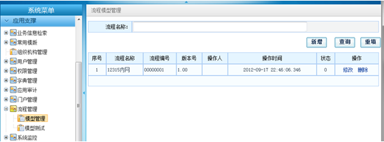
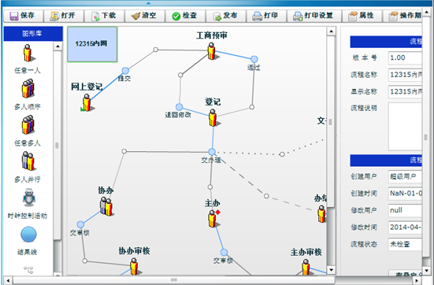

# 流程引擎接口（下）

### 配置文件

#### 流程配置文件

流程配置文件位于com.wondersgroup.esf.flowengine.EFConstants下。

**目前esf.jar包仅支持读取数据库数据**

主要内容如下：
```[java]
/**
 * 流程数据来源，1表示来自文件，2表示来自数据库
 */
public static String SOURCE_TYPE = "2";
//
/**
 * 流程数据文件夹路径
 */
public static String FILE_FLOW_PATH = "/esf-flow/flowxml";
//
/**
 * 流程数据数据库表名，一般无需改动，如有特殊需求，可自行改动 
 */
public static final String DATABASE_DIC_FLOW = "DIC_FLOW";
public static final String DATABASE_DIC_FLOW_DATA = "DIC_FLOW_DATA";
public static final String DATABASE_FL_ACTIVITY = "FL_ACT";
public static final String DATABASE_FL_ACTIVITY_AUTO = "FL_ACT_AUTO";
public static final String DATABASE_FL_ACTIVITY_DAYS = "FL_ACT_DAYS";
public static final String DATABASE_FL_ACTIVITY_PARAMETER = "FL_ACT_PARAMETER";
public static final String DATABASE_FL_ACTIVITY_RELATION = "FL_ACT_RELATION";
public static final String DATABASE_FL_ACTIVITY_USER = "FL_ACT_USER";
public static final String DATABASE_FL_ACTIVITY_VIEW = "FL_ACT_VIEW";
public static final String DATABASE_FL_INST = "FL_INST";
public static final String DATABASE_FL_INST_CHANGE = "FL_INST_CHANGE";
public static final String DATABASE_FL_PARAMETER = "FL_PARAMETER";
```

#### 流程信息文件

具体流程运转的xml文件可由上面流程配置文件进行配置

默认是在/esf-flow/flowxml/目录下

#### 流程模型管理

http://localhost:8080/esf/esf/flowmanage/flowlist.do





提示：在画流程图的时候，窗口要最大化，否则屏幕小的电脑，右下角的部分属性可能看不到；{: style="color: red;"}


