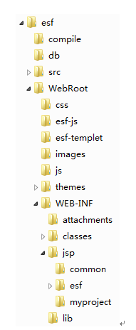
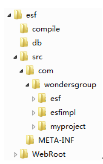

# 框架开发规范（上）

### 目录结构规范

#### WEB应用目录结构

WEB应用目录结构如下图所示：

目录结构说明如下：

|目录|  说明|
| :- | :-------: |
|WebRoot| Web应用根目录，可放置一些公用的静态html文件，或者需要直接访问的公用jsp文件|
|css |放置应用系统公用css样式文件，控制不涉及换肤的页面样式|
|esf-js | 放置框架js文件，主要是JQuery相关js文件，项目组不可以修改此目录中的内容|
|esf-templet| 放置框架中的页面模板文件，项目组在页面模板基础上开发jsp页面，项目组不可以修改此目录中的内容|
|images | 放置应用系统公用图片文件，此目录图片不涉及换肤|
|Js|  放置应用系统自有的js文件，项目组可以自行维护该目录中的内容|
|themes | 换肤目录，每个子目录代表一个换肤风格，子目录中放置了换肤相关的css样式文件和图片文件|
|WEB-INF |Web应用的保护性目录，放置web.xml、spring mvc等配置文件|
|WEB-INF/classes| 项目开发的所有类、log4j配置文件、spring配置文件、数据库连接配置文件、应用配置文件|
|WEB-INF/jsp |应用中所有的通过控制层访问的jsp文件，放置在该目录的子目录中|
|WEB-INF/jsp/common | 放置被其他jsp文件引用的公用jsp文件|
|WEB-INF/jsp/esf |放置框架用jsp文件，项目组不可以修改此目录中的内容|
|WEB-INF/jsp/myproject  | 放置应用系统jsp文件，下面可以按照模块建立子目录|
|WEB-INF/lib |项目所使用到的类库|

#### 类结构

Java代码的类结构如下图所示：

从图中可以看出，我们的类结构在com.wondersgroup下分三个包：

|包 | 说明|
| :- | :-------: |
|Esf| 框架类，项目组不可以修改|
|esfimpl| 框架接口实现类。如果应用系统使用第三方应用支撑系统，那么需要在此包中实现框架接口，如果应用系统使用本框架中的应用支撑功能，那么此包可以不要。|
|myproject |  放置应用系统实现类，包名可以根据具体项目调整，建议调整为有项目意义的包名。|

