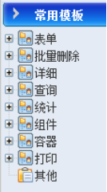
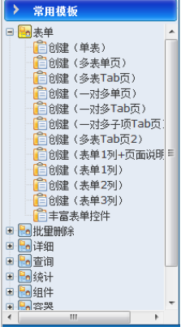
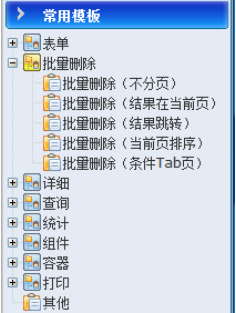
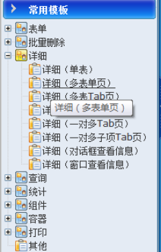

# 页面模板（上）

本框架提供丰富的页面模板文件，所有模板文件存放在WebRoot/esf-templet目录中。

http://127.0.0.1:8080/wt//template.jsp

### 模板类型说明

模板的类型见下图：

#### 表单类

+ 单表：页面上只有一个表格。
+ 多表单页：页面上有多个表格。
+ 多表Tab页：页面上有多个表格，用Tab页的方式显示。
+ 一对多单页：页面上有表格，同时存在列表项。
+ 一对多Tab页：“一对多单页”用Tab方式显示。
+ 一对多子项Tab页：“单表”和“多表Tab页”的合并。
+ 多表Tab页2：Tab页单击，加载页面。
+ 表单1列+页面说明：页面上的表格只有一列（一对TD），表格后面还有针对本页的一些说明性文字。
+ 表单2列：2对TD。
+ 表单3列：3对TD。
+ 丰富表单控件：页面的表单控件比其他模版相对丰富一点。

#### 批量删除

批量删除是为了方便用户可以同时删除一组数据。

批量删除，该类模版就按照查询的类型来区分，在查询结果中选中，并删除。目的是为了删除,具体的查询功能可参照查询类，

#### 详细

详细类模版，是针对查看信息类页面做的一套模版，具体可分为如下：

+ 单表：页面上只有一个表格。
+ 多表单页：页面上有多个表格。
+ 多表Tab页：页面上有多个表格，用Tab页的方式显示。
+ 一对多单页：页面上有表格，同时存在列表项。
+ 一对多Tab页：“一对多单页”用Tab方式显示。
+ 一对多子项Tab页：“单表”和“多表Tab页”的合并。
+ 对话框查看信息：查询结果，点击详细时，弹出一个对话框的方式。
+ 窗口查看信息：查询结果，点击详细时，弹出一个新窗口的方式。

