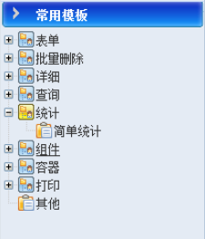
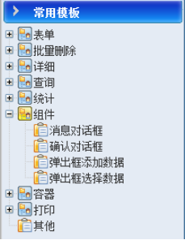

# 页面模板（中）

#### 查询


+ 不分页：查询结果是不分页。
+ 结果在当前页：查询结果是分页的。
+ 结果跳转：查询结果为跳转页。
+ 当前页排序：点击列头时，查询结果根据当前列，对页面上的数据进行排序。
+ 重新查询：点击列头时，根据该列对应的数据库字段名称，重新查询数据库，不是排序页面上的数据。
+ 条件Tab页：查询条件按Tab页显示。
+ 结果Tab页：查询结果Tab页显示。
+ 条件+结果Tab页：查询条件和查询结果均以Tab页显示。

#### 统计

统计，目前该类模版只做了一个简单的统计。



+ 简单统计：对统计结果进行一个汇总，汇总的功能是在jsp上完成的。

#### 组件

自定义的一些功能组件。



+ 消息对话框：功能类似js的alert，参考jquery.util.js中的showMessage函数。

```[javascript]
function showMessage(message, callback, showCancelButton)
 * @param message 提示消息
 * @param callback 回调函数名称
 * @param showCancelButton 显示“取消”按钮
```

+ 确认对话框：功能类似js的confirm，函数同“消息对话框”。
+ 弹出框添加数据：在主页面上弹出一个对话框，然后在弹出框中添加数据，并把相应的数据添加到父页面中；
+ 弹出框选择数据：在主页面上弹出一个对话框，然后在弹出框中查询数据，并把相应的数据设置到父页面中。
