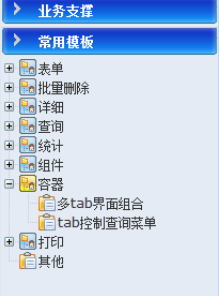
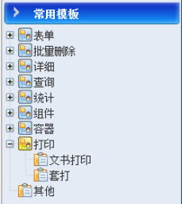

# 页面模板（下）

#### 容器

多种页面组件的组合。

#### 打印

针对文书打印和套打。

+ 文书打印：使用的是金格iWebOffice控件，组件的使用方法是：
    1. 自定义一个文书模版，然后在模版上添加相应的页签（BookMark）。参考`webPrint\Template\01.doc`。
    2. 在实际使用时，导入模版，然后设置页签的数据。参考`webPrint\notice_print.jsp`。
            模版导入：参照第80行和60行
            设置页签：参照第67行
+ 套打：使用的是ScriptX组件

#### 其它

这里有一些测试性的控件，仅供参考。

### 页面模板开发说明

模版页面中比较关键的几个部分说明一下，每个模版页面都包含3个文件，分别是：

`<%@ include file="taglib.jsp" %>`

这个文件里面包含的是标签引用库，包括**jstl**的**c**、**fmt**、**fn**以及自定义标签，其他暂时不推荐使用。

`<%@ include file="include.jsp"%>`

这个文件包含的是css文件的引用和js文件的引用

`<%@ include file="init.jsp"%>`

对整个页面的所有组件进行一个初始化和其他一些处理，比如：日期、提示、表单收缩、样式设置等。

**以上3条都要保留，并且不要去修改里面的内容，当在esf升级时，业务系统能够和esf的版本能保持一致，否则可能造成不兼容问题。**

**应用系统人员开发页面时，首先选择一个合适的模板文件，将模板文件复制到合适的位置，改成合适的文件名。开发过程中，根据实际业务调整页面数据获取逻辑，调整页面显示的具体内容，不要调整界面显示布局和显示样式。**