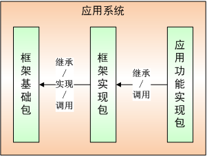
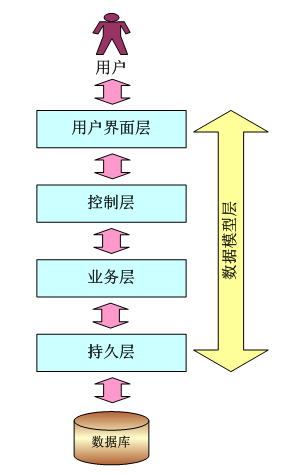

# 技术架构

### 代码构成

应用系统代码，由通用基础包、应用支撑包和应用功能实现包三部分组成。

如下图所示：

+ “框架基础包”基于后台框架jar包和前台js开发框架实现，并提供标准接口供框架实现包实现，供应用功能开发包调用。框架基础包不依赖于框架实现包和应用功能实现包。框架基础包可同时适用于不同项目。项目组不可以修改框架基础包中的内容。
+ “框架实现包”是基于“框架基础包”实现，包括对框架基础包中接口的实现，已经项目相关css、图片等的实现。框架实现包适用于一个具体的项目，并同时适用了该项目的各子项目。
+ “应用功能实现包”基于“框架基础包”和“框架实现包”的开发框架实现，三者一起形成一个完整的可部署的应用系统。
+ “应用功能实现包”通过服务的方式实现和其它业务应用系统的互动，既可作为服务提供者，又可作为服务消费者，不可以直接访问其它系统的数据。
+ 框架基础包在进行版本升级时，不应该修改供框架实现包、业务实现包实现和调用的标准接口，应保证版本向下兼容性。

### 技术分层

应用系统开发框架的技术分层结构如下图所示：

从上图可以看出，从数据库到用户之间，分为了4个层次：持久层、业务层、控制层、用户界面层。另外还有一个数据模型层，它是贯穿与另外4个层次的。每个层次都可以选用不同的技术架构来实现。

各层的主要职责如下：

+ 用户界面层：直接与用户打交道，负责数据的页面显示，数据的界面录入和验证，并向控制层发出数据处理请求。
+ 控制层：接受用户通过用户界面层发出的数据处理请求，并调用业务层处理数据，然后将处理结果返回给用户界面层。
+ 业务层：负责应用程序逻辑处理和事务管理。它由控制层调用，并调用相关持久层方法实现逻辑和事务处理。
+ 持久层：直接与数据库进行通信，通过数据库查询和执行语句，存取数据库数据。持久层由业务层进行调用。
+ 数据模型层：数据模型是对象集合，它只负责数据的封装，不进行逻辑处理。数据模型包括持久层数据对象和值数据对象两种。数据模型在不同层之间移动。

### 技术选型

本次框架技术选型基于jdk1.6选型。

+ 框架整合：Spring 3.1，spring是后台技术框架的核心，通过IOC和AOP实现不同开源框架的整合和事务的统一管理。
+ 持久层：选用JPA1.0规范，并选择hibernate3.3对JPA1.0规范的实现作为持久层框架，spring3.1提供了JPA1.0规范的支持，spring3.1和hibernate3.3可以基于JPA规范无缝集成。
+ 控制层：选用springMVC 3.1，springMVC 3.1和spring3.1提供方相同，版本一致，相互集成性好，而且springMVC的版本向下兼容性较好（相比于struts而言）。
+ Js框架：JQuery1.7 + JQuery-UI1.8.2，jQuery为轻量级、基础级js框架，其封装没有ext严实，jQuery版本向下兼容性较好，开发过程中对html的代码结构保持的较好，调试更加容易，而且jQuery一直是开源的。
+ 配置文件：annotation + xml：尽量基于全注解方式实现，通用配置放在xml文件中。
+ Web服务：Rest，类似一种轻量级的web service服务，比web service更加高效。