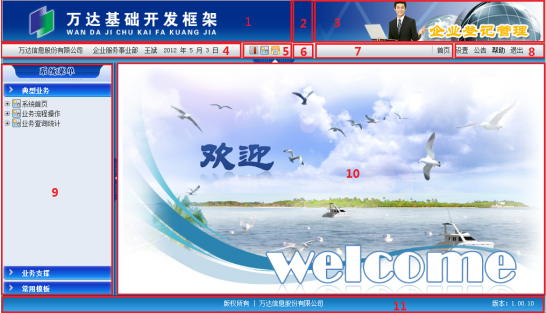

# 界面布局声明

框架应用的界面布局如下图所示：

界面布局总体上分为5大区域，11个部分：

+ Head区域：由1、2、3部分组成
+ 上侧菜单区域：由4、5、6、7、8部分组成
+ 左侧菜单区域
+ 主操作区域
+ 脚注区域

### Head区域

Head区域分为左、中、右三部分。

左侧为logo区域，logo以图片形式展现，图片相对路径需配置在app.properties文件中。本区域不含应用逻辑。

中间为可伸缩区域，这个是为了适应客户端不同的分辨率，本区域不含应用逻辑。

右侧区域为具体应用系统的名称信息，应用系统的名称以图片形式展现，图片相对路径需配置在app.properties文件中。本区域不含应用逻辑。

### 上侧菜单区域区域

上侧菜单区域从左到右分为5个部分。

左侧部分为用户单位、部门、姓名和日期信息，其中单位、部门、姓名根据登录用户的用户信息从数据库获取，日期信息从应用服务器获取。

第二部分为用户自定义“快捷菜单”展示区域。

第三部分为可伸缩区域，这个是为了适应客户端不同的分辨率，本区域不含应用逻辑。

第四部分为应用系统自定义链接区域，包括首页、待办事务、已办事务等都可以在此定义，定义内容包括显示名称和链接URL，自定义内容配置在app.properties中。该区域链接点击后，页面将在主操作区域打开。

右侧部分为固定功能区域，包括设置、公告、帮助、退出四个功能。设置和公告的功能已层的方式展现。帮助的内容为pdf等格式的文件，部署在应用系统路径下，需在app.properties中配置URL链接，帮助内容在弹出窗口中显示。退出时，将清空应用session，并关闭应用窗口。

### 左侧菜单区域区域

左侧菜单区域中菜单的显示，根据应用系统编号及登录用户的权限来控制，最多支持3级菜单。点击菜单页节点后，界面在主操作区打开。

左侧菜单区域将提供菜单隐藏和展示的功能，通过界面js来控制。

### 主操作区域

主操作区域根据左侧菜单区域的菜单和上侧菜单区域的功能链接打开页面。需在app.properties中配置应用系统首页URL，供应用系统登录时默认打开。

### 脚注区域

脚注区域放置版权信息和应用版本信息。版权信息的文字配置在app.properties文件中。版本信息根据app.properties配置文件中的应用系统编号从数据库中获取。